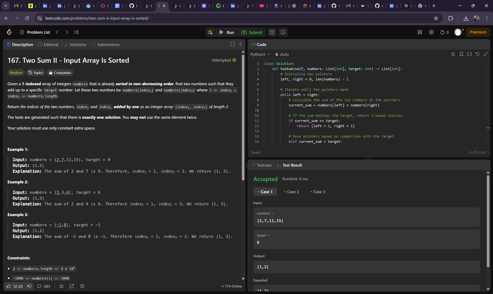
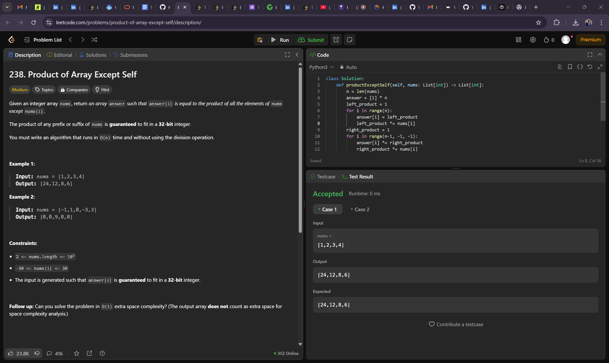
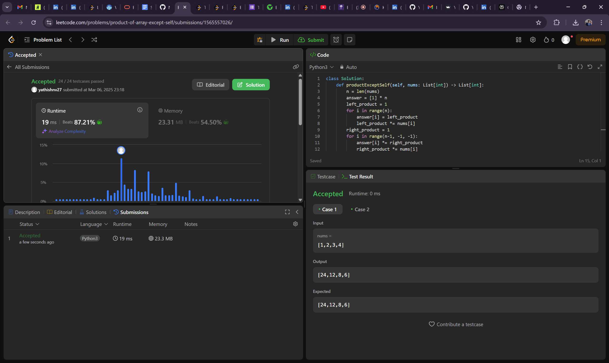
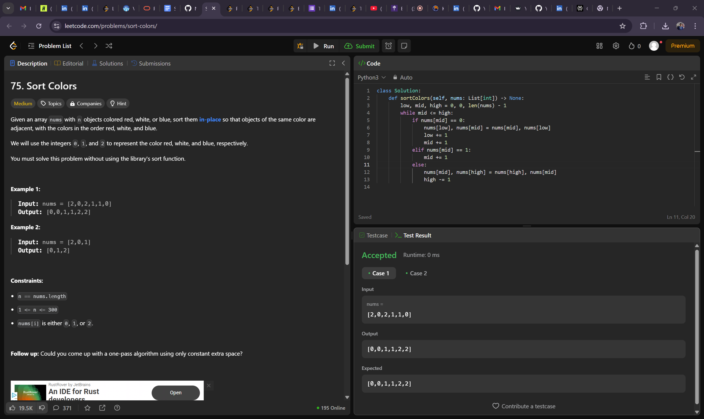
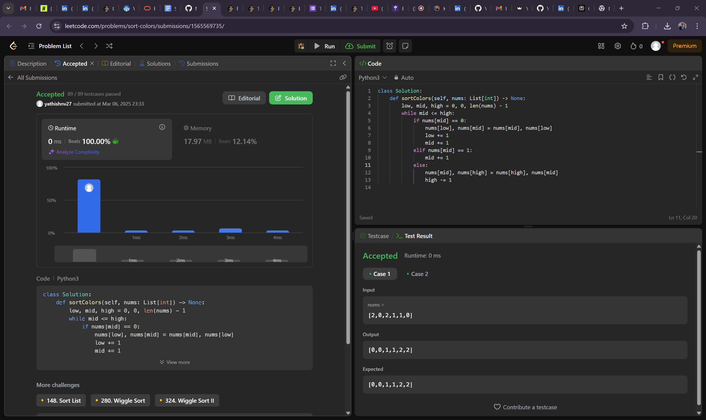

# Algorithm Problems 

This repository contains solutions algorithm problems, including **Two Sum II - Input Array Is Sorted**, **Product of Array Except Self**, and **Sort Colors**.
## 1. Two Sum II - Input Array Is Sorted

### Problem Description
Given a 1-indexed array of integers `numbers` sorted in non-decreasing order, find two numbers such that they add up to a specific target number. Return their indices as `[index1, index2]`.

### Example
Input: `numbers = [2,7,11,15], target = 9`  
Output: `[1,2]`

### Solution Explanation
We use the **two-pointer technique** to solve this problem in \(O(n)\) time.

### Visual Explanation

---

## 2. Product of Array Except Self

### Problem Description
Given an integer array `nums`, return an array `answer` such that `answer[i]` is equal to the product of all the elements of `nums` except `nums[i]`. Solve this without using division and in \(O(n)\) time.

### Example
Input: `nums = [1,2,3,4]`  
Output: `[24,12,8,6]`

### Solution Explanation
We calculate the product of elements to the left and right of each index using two passes over the array.

### Visual Explanation

---

## 3. Sort Colors

### Problem Description
Given an array `nums` with \(n\) objects colored red (0), white (1), or blue (2), sort them in-place so that objects of the same color are adjacent and in the order red, white, and blue.

### Example
Input: `nums = [2,0,2,1,1,0]`  
Output: `[0,0,1,1,2,2]`

### Solution Explanation
We use the **Dutch National Flag Algorithm** to sort the array in a single pass with constant space.

### Visual Explanation

---

