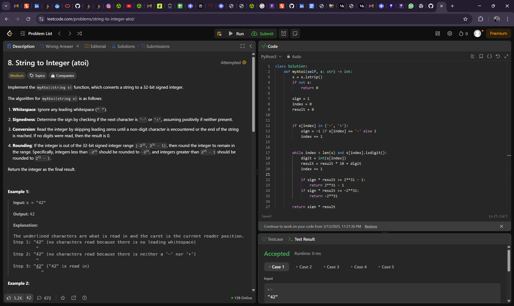
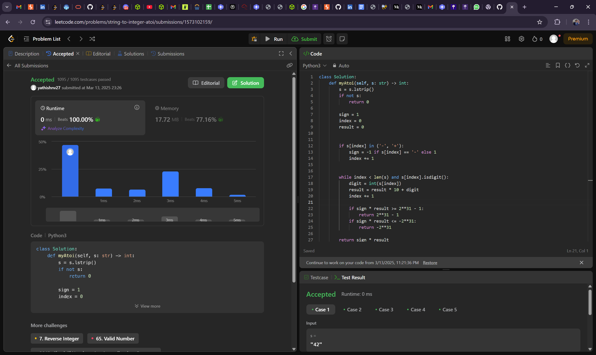
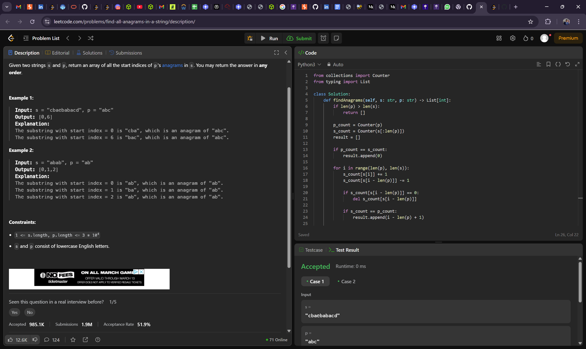
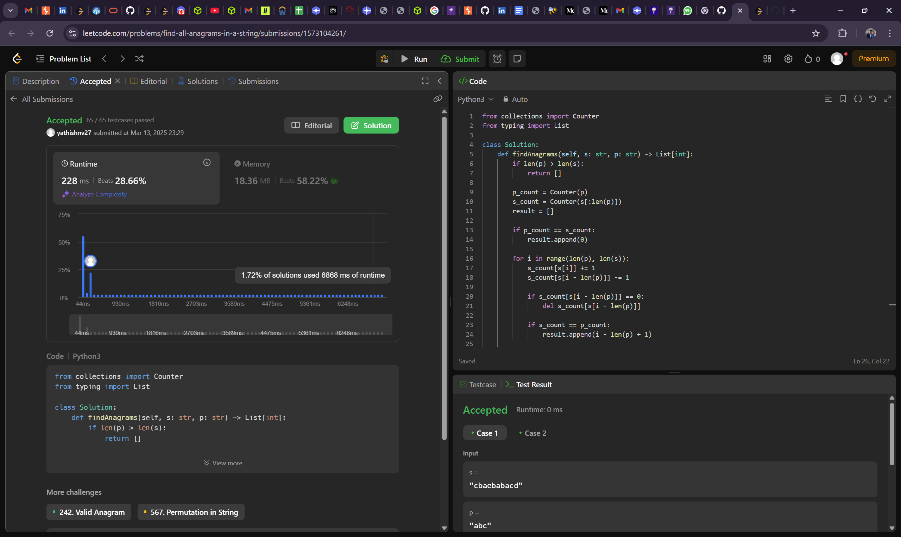
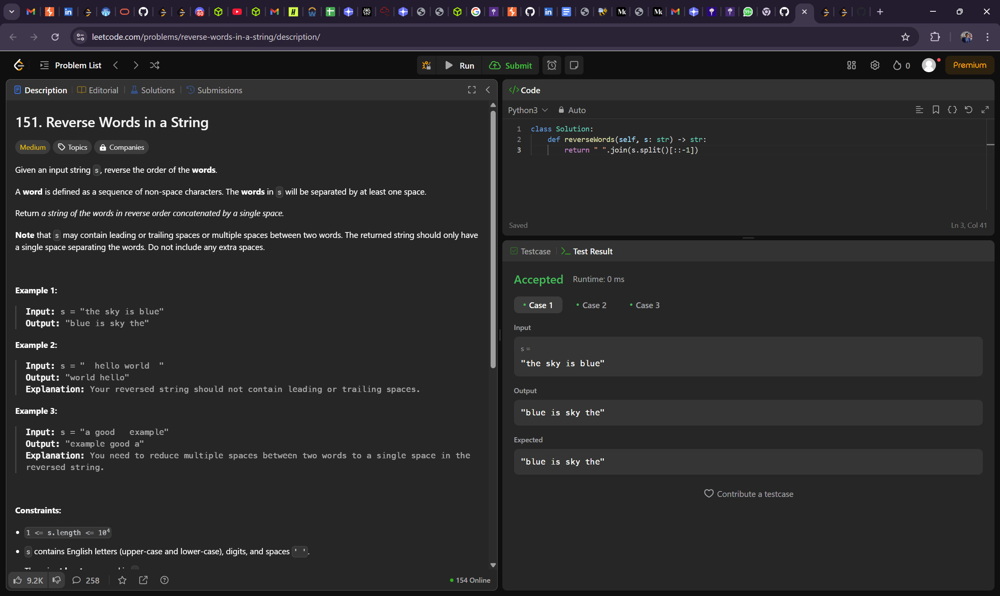
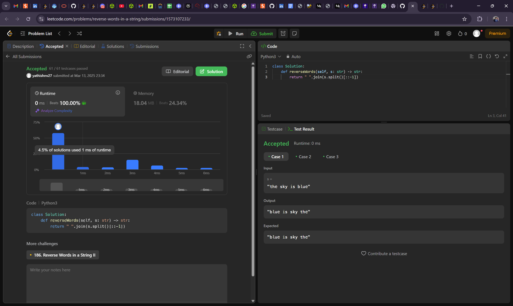

# Algorithm Problems 

This repository contains solutions algorithm problems, including **Two Sum II - Input Array Is Sorted**, **Product of Array Except Self**, and **Sort Colors**.
## 1.  String to Integer (atoi)

### Problem Description
Implement the myAtoi(string s) function, which converts a string to a 32-bit signed integer.

The algorithm for myAtoi(string s) is as follows:

Whitespace: Ignore any leading whitespace (" ").
Signedness: Determine the sign by checking if the next character is '-' or '+', assuming positivity if neither present.
Conversion: Read the integer by skipping leading zeros until a non-digit character is encountered or the end of the string is reached. If no digits were read, then the result is 0.
Rounding: If the integer is out of the 32-bit signed integer range [-231, 231 - 1], then round the integer to remain in the range. Specifically, integers less than -231 should be rounded to -231, and integers greater than 231 - 1 should be rounded to 231 - 1.
### Example
Input: s = "42"
Output: 42

### Visual Explanation

---

## 2. Find All Anagrams in a String

### Problem Description
Given two strings s and p, return an array of all the start indices of p's anagrams in s. You may return the answer in any order.

### Example
Input: s = "cbaebabacd", p = "abc"
Output: [0,6]

### Visual Explanation

---

## 3. Sort Colors

### Problem Description
Given an array `nums` with \(n\) objects colored red (0), white (1), or blue (2), sort them in-place so that objects of the same color are adjacent and in the order red, white, and blue.

### Example
Input: `nums = [2,0,2,1,1,0]`  
Output: `[0,0,1,1,2,2]`

### Solution Explanation
We use the **Dutch National Flag Algorithm** to sort the array in a single pass with constant space.

### Visual Explanation

---

