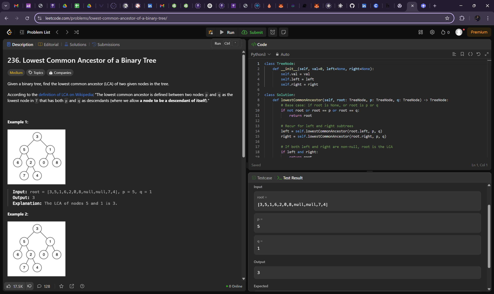

# Algorithm Problems 

## 1.Lowest Common Ancestor of a Binary Tree

### Problem Description
Given a binary tree, find the lowest common ancestor (LCA) of two given nodes in the tree.

According to the definition of LCA on Wikipedia: “The lowest common ancestor is defined between two nodes p and q as the lowest node in T that has both p and q as descendants (where we allow a node to be a descendant of itself).”

### Example

Input: root = [3,5,1,6,2,0,8,null,null,7,4], p = 5, q = 1
Output: 3
Explanation: The LCA of nodes 5 and 1 is 3.

### Visual Explanation

---

## 2. Decode String

### Problem Description
Given an encoded string, return its decoded string.

The encoding rule is: k[encoded_string], where the encoded_string inside the square brackets is being repeated exactly k times. Note that k is guaranteed to be a positive integer.

You may assume that the input string is always valid; there are no extra white spaces, square brackets are well-formed, etc. Furthermore, you may assume that the original data does not contain any digits and that digits are only for those repeat numbers, k. For example, there will not be input like 3a or 2[4].

The test cases are generated so that the length of the output will never exceed 105.

 
### Example
Example 1:

Input: s = "3[a]2[bc]"
Output: "aaabcbc"

### Visual Explanation

---

## 3. Number of People Aware of a Secret

### Problem Description
On day 1, one person discovers a secret.

You are given an integer delay, which means that each person will share the secret with a new person every day, starting from delay days after discovering the secret. You are also given an integer forget, which means that each person will forget the secret forget days after discovering it. A person cannot share the secret on the same day they forgot it, or on any day afterwards.

Given an integer n, return the number of people who know the secret at the end of day n. Since the answer may be very large, return it modulo 109 + 7.

### Example
Input: n = 6, delay = 2, forget = 4
Output: 5

### Visual Explanation

---

