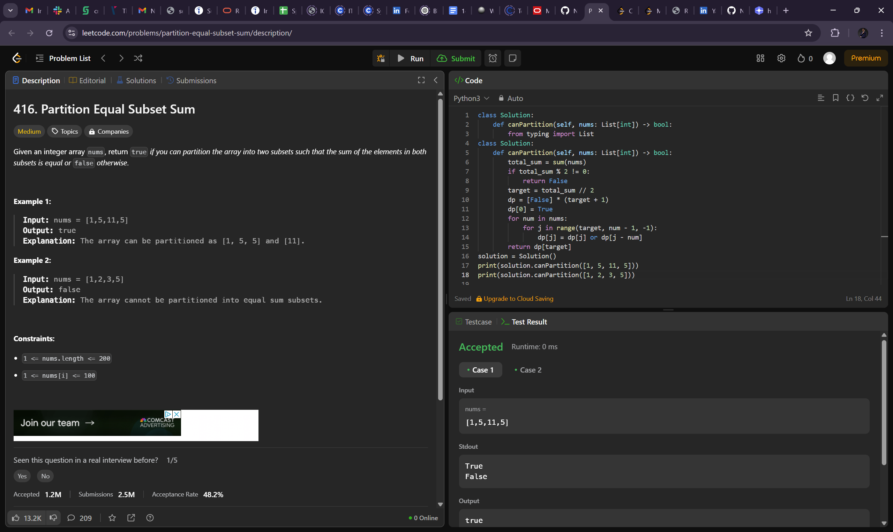
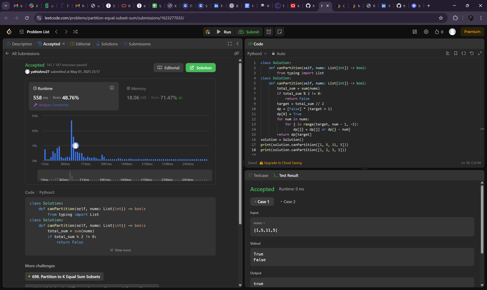
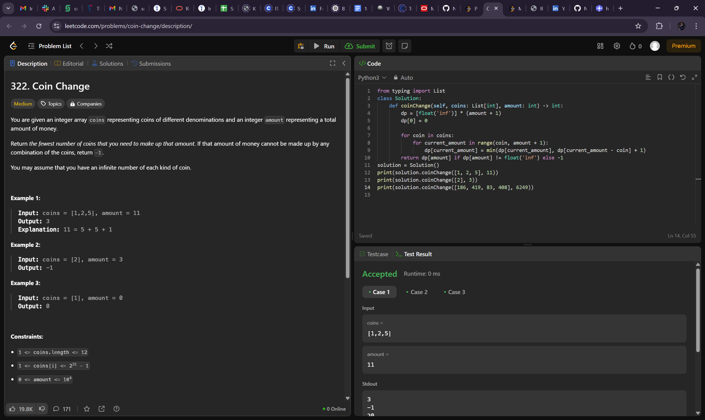
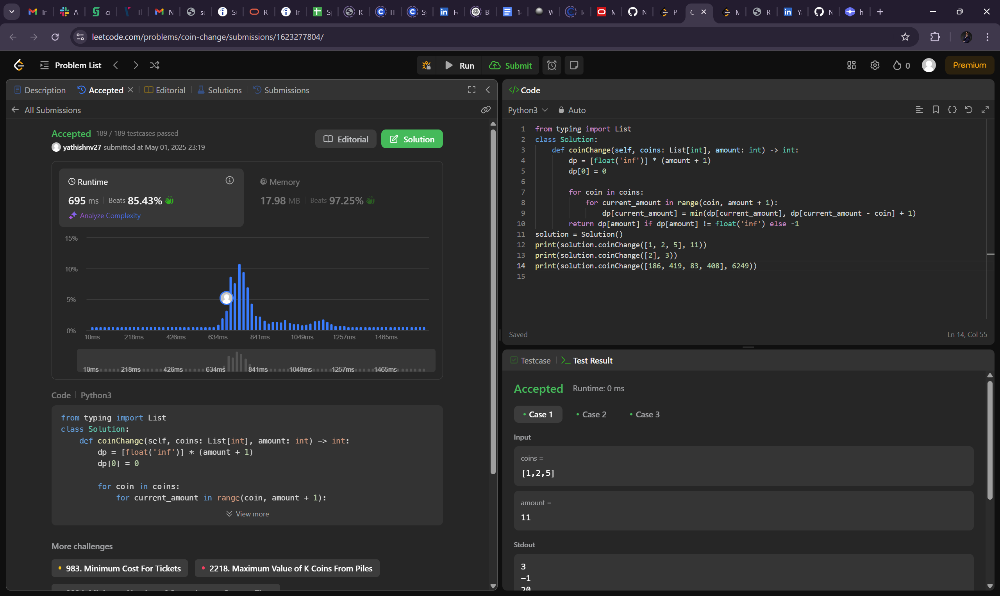
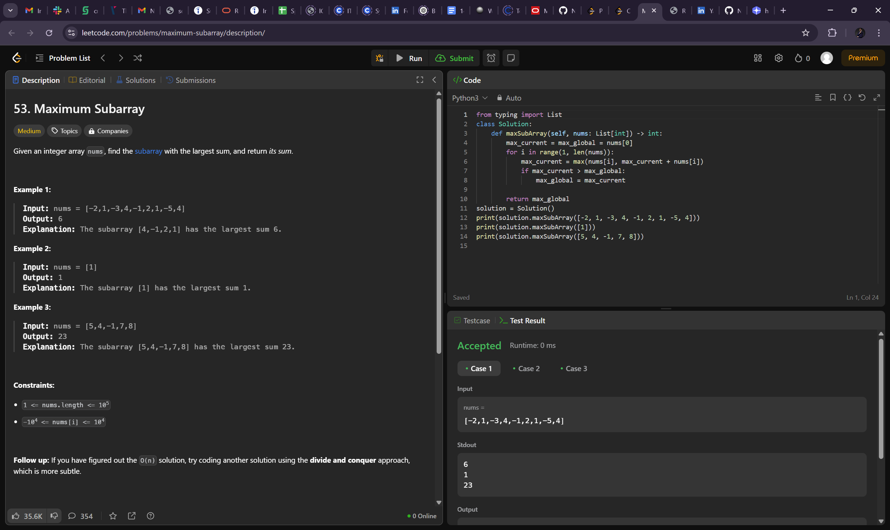
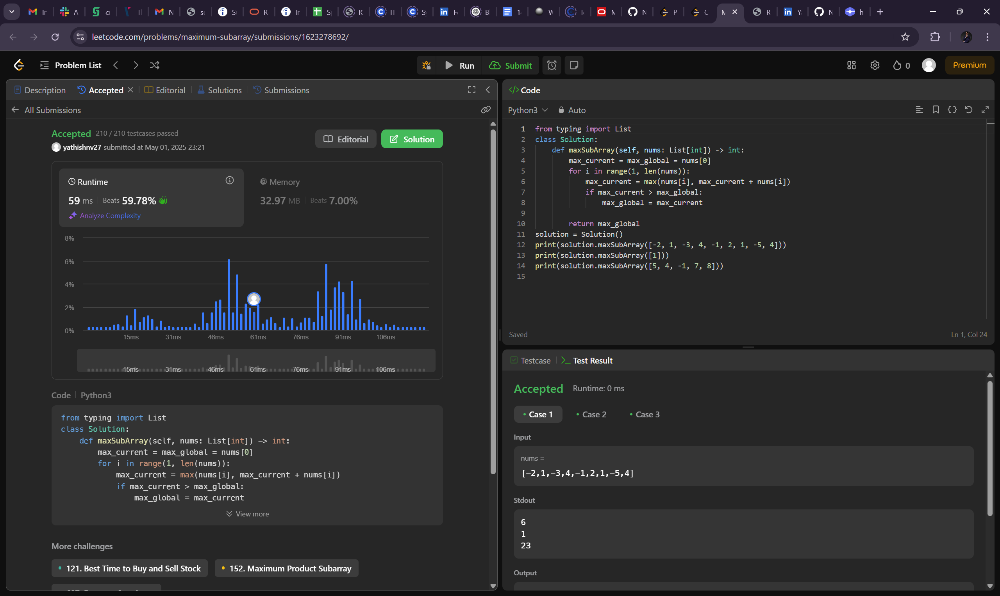

# Algorithm Problems 

## 1.Partition Equal Subset Sum

### Problem Description
Given an integer array nums, return true if you can partition the array into two subsets such that the sum of the elements in both subsets is equal or false otherwise.

 

### Example
Example 1:
Input: nums = [1,5,11,5]
Output: true
Explanation: The array can be partitioned as [1, 5, 5] and [11].
Example 2:
Input: nums = [1,2,3,5]
Output: false
Explanation: The array cannot be partitioned into equal sum subsets.

### Visual Explanation

---

## 2.  Rotting Oranges

### Problem Description
You are given an integer array coins representing coins of different denominations and an integer amount representing a total amount of money.

Return the fewest number of coins that you need to make up that amount. If that amount of money cannot be made up by any combination of the coins, return -1.

You may assume that you have an infinite number of each kind of coin.
 
### Example
Example 1:

Input: coins = [1,2,5], amount = 11
Output: 3
Explanation: 11 = 5 + 5 + 1
Example 2:

Input: coins = [2], amount = 3
Output: -1
Example 3:

Input: coins = [1], amount = 0
Output: 0
 

### Visual Explanation

---

## 3.Maximum Subarray

### Problem Description
Given an integer array nums, find the subarray with the largest sum, and return its sum.
### Example
Example 1:

Input: nums = [-2,1,-3,4,-1,2,1,-5,4]
Output: 6
Explanation: The subarray [4,-1,2,1] has the largest sum 6.
Example 2:

Input: nums = [1]
Output: 1
Explanation: The subarray [1] has the largest sum 1.
Example 3:

Input: nums = [5,4,-1,7,8]
Output: 23
Explanation: The subarray [5,4,-1,7,8] has the largest sum 23.

### Visual Explanation

---

